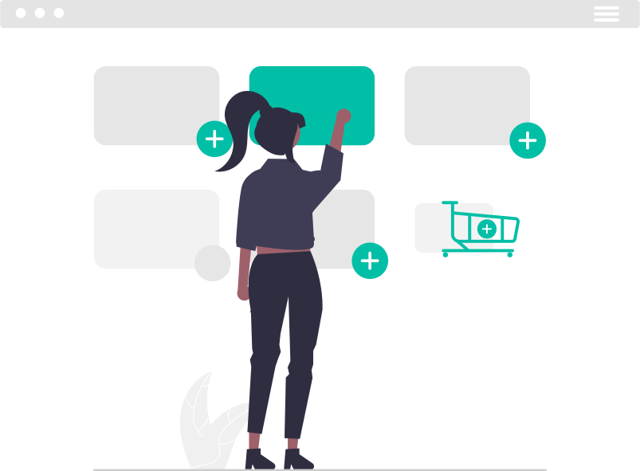

<!-- Header -->
<h1 style='text-align:center; color:#FFFFFF'>🛍️ Online Store </h1>

<div style="display:flex; justify-content:center; align-items:center">
    
</div>

# 📚 <span style="color:#03cea4">Tools</span>
<div style="text-align:center">

[](https://skillicons.dev)

</div>

## <div style="text-align:center">😎 client-side</div>
<ul style="display:flex; flex-direction:column; justify-content:center; align-items:center">

[](https://skillicons.dev)

[](https://skillicons.dev)

[](https://skillicons.dev)

[](https://skillicons.dev)

</ul>

## <div style="text-align:center">💻 server-side</div>
<ul style="display:flex; flex-direction:column; justify-content:center; align-items:center">

[](https://skillicons.dev)

[](https://skillicons.dev)

[](https://skillicons.dev)

[](https://skillicons.dev)

</ul>

# <span style="color:#03cea4">Installation</span>

```
$ git clone https://github.com/Islam-Turky/OnlineStore.git
$ cd OnlineStore/client
$ npm install
$ cd..
$ cd OnlineStore/server
$ npm install
```